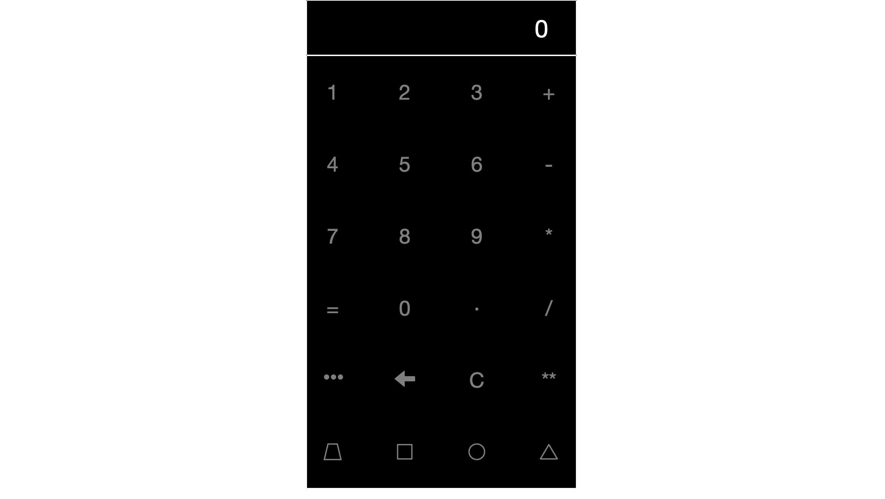
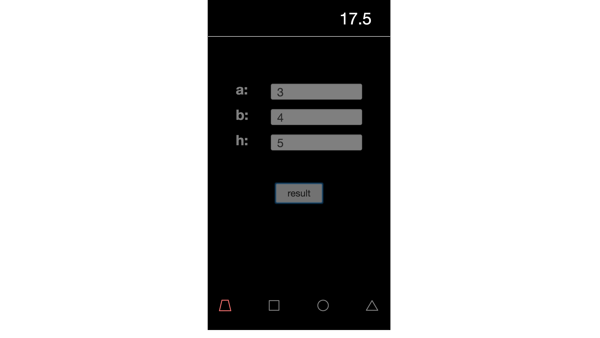

学习运用node+socketIO做一个小型计算器后台（这样看起来累赘，目的是为了学习node和前后端socket通讯而写的Demo），前端由vue来进行交互和通讯

</img>

</img>

项目clone完还需运行index.js完成部署
设置了发布端口为http://localhost:3011 浏览器输入既打开啦...

# myCalculatorDemo
node+vue+bootstrap做的web计算器
